#Creacion de un Repositorio#  
Creamos una carpeta con ``` mkdir``` y hacemos ``` git init``` para darle acceso y hacemos ``` code .```  
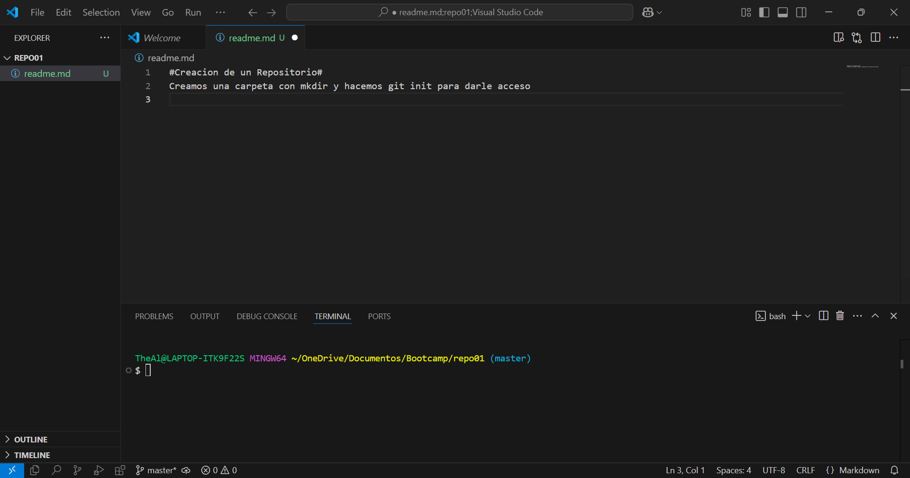  
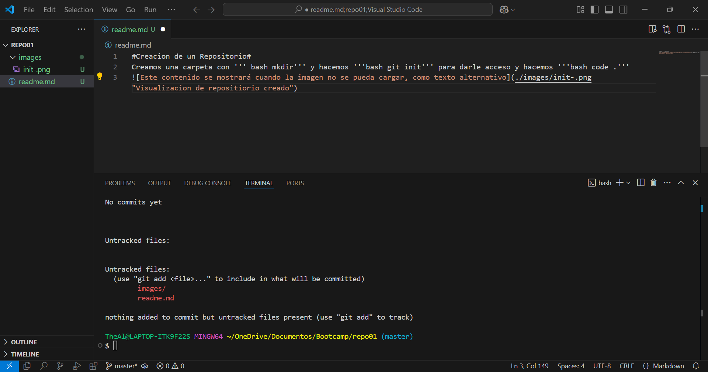 
Pasamos el estado del documento de Untracked a staging area con 
``` git add```  
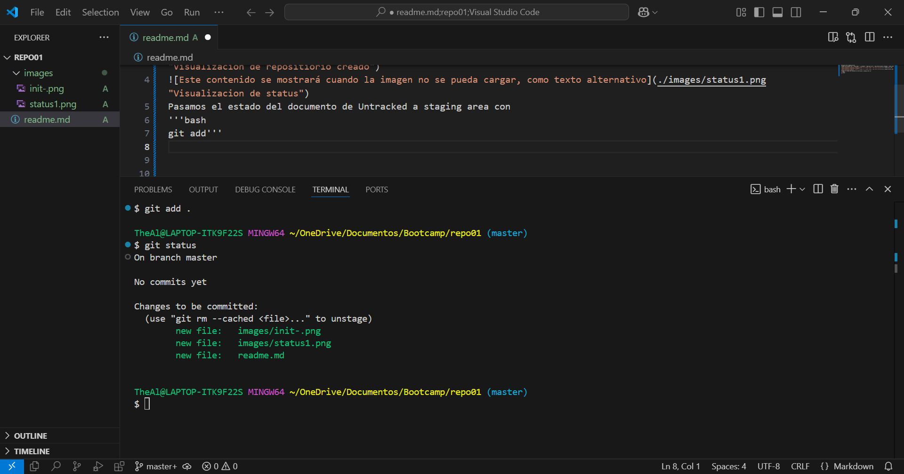  
El estado del documento es unmodified hasta el momento en el que escribo esto que entonces pasa a estar modified.  
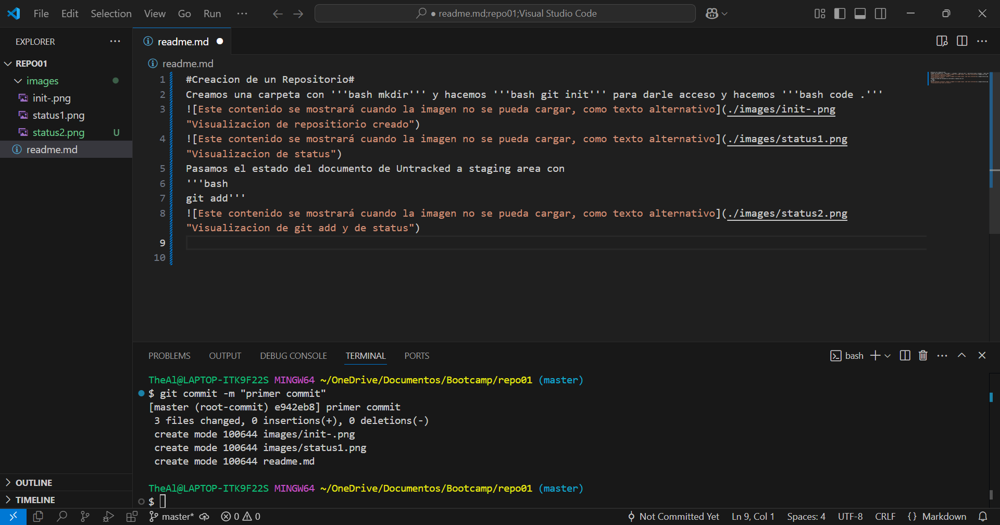  
Al hacer el git push no ocurre nada debido a que no tiene nombre ni esta conectado con el **repositorio remoto** por ese mismo motivo ```git remote -v``` No nos mostrara nada.  
Creamos el repositorio en github y lo asociamos.
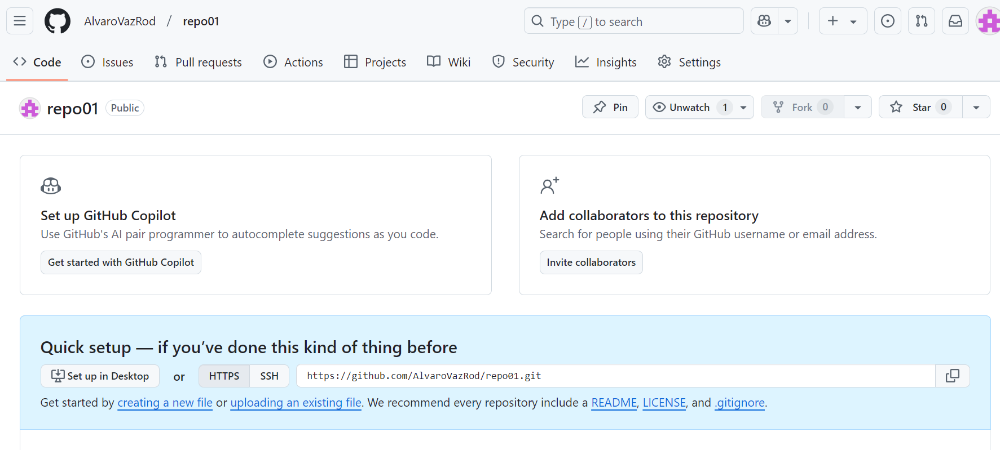  
Asociamos el repositorio local.  
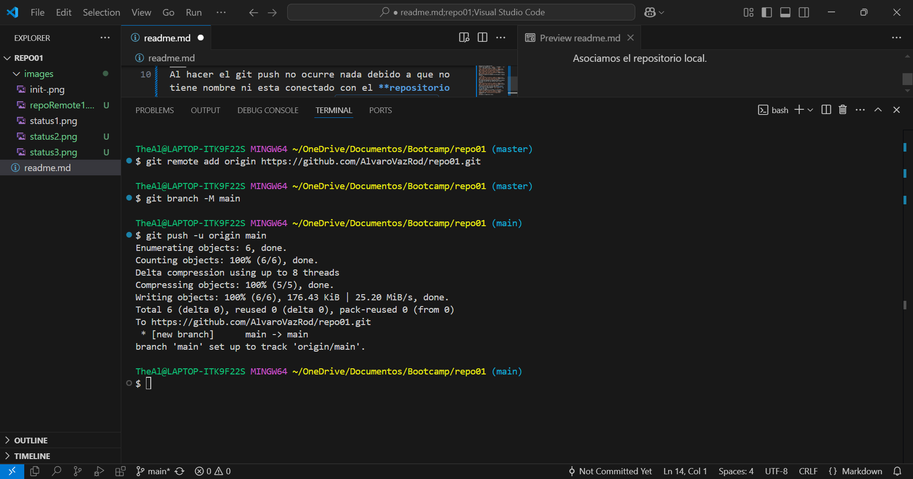  
Ejecutamos el comando ```git remote -v```  
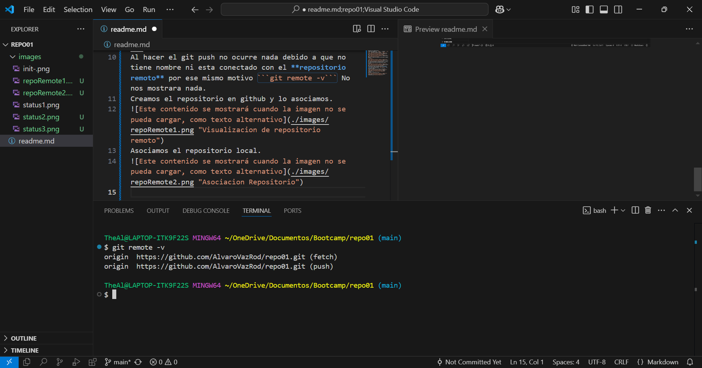  
Subimos todo los archivos al repositorio locar y al remoto.  
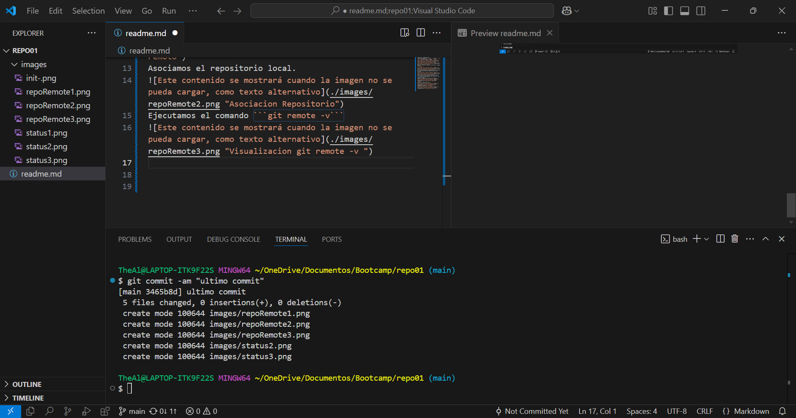  

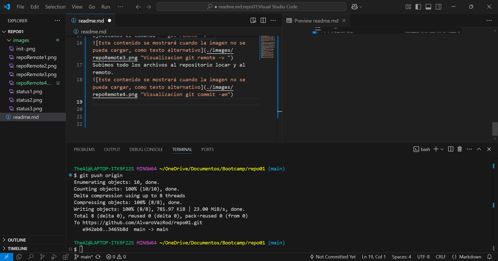   

Asi quedaria el repositorio remoto  
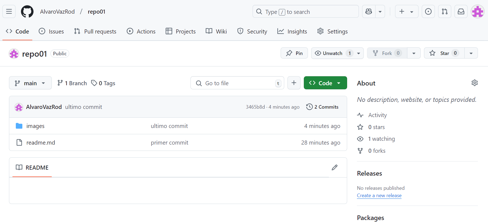   
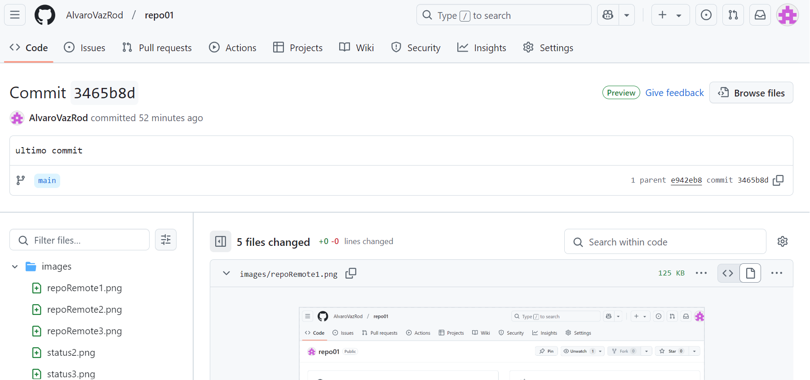  
